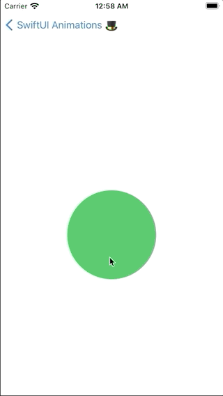
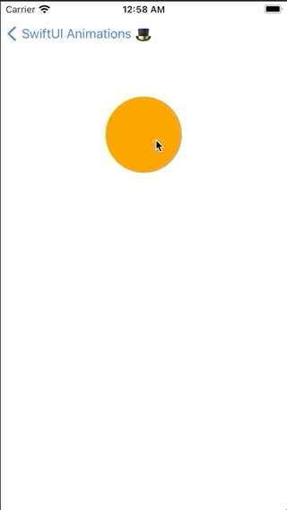
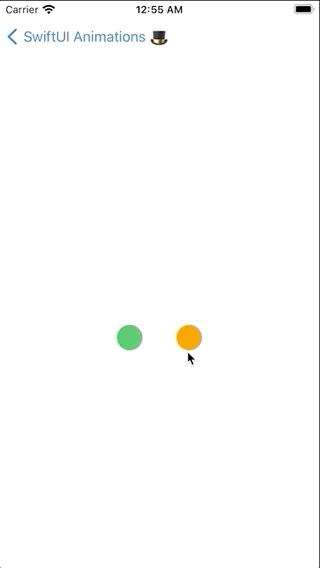

# SwiftUI animations & matchedGeometryEffect 🎩

Demo app with basic SwiftUI animations using matched geometry effect.

Created based on this article: <https://www.appcoda.com/matchedgeometryeffect/>

## ❶ Growing Circle Animation

## ❷ Circle To Rectangle Morphing

## ❸ Circle To Full Screen Morphing

## ❹ Swapping dots

